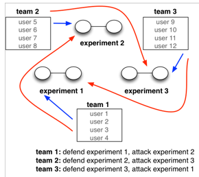
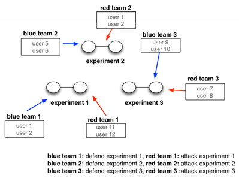

!!! important
    Our current support for competitions is limited. Please read this page carefully. 

Competitions on DETERLab
==============

DETERLab can be used to run attack/defense exercises between teams of students or researchers. In such an exercise, a given experiment will be accessed by two teams - a blue (defense) team and a red (offense) team. DETERLab competitions UI enables:

- Easy creation of experiments and teams
- Specification of which teams can access which experiments and which machines in an experiment
- Experiment setup (swap in, application installation)

!!! Important
    Examples below assume that you want to run a competiton called *MyComp* in a class called *MyClass* on our new infrastructure. You will also need a project, which we will assume is called *MyCompProject*.

## Enabling competitions


If you wish to run competitions within your DETERLab project, please submit a ticket and provide rough estimates of how often you would run and how many machines you would need. We will review and enable competitions feature for your project.

## New competition

You can create a new competition from your "My DETERLab" view. There will be a "Competitions" tab once you have a competition-enabled project. From that tab, you can click on the left-hand menu option "New competition".

The dialogue will ask you for the competition name and folder path. Currently you *must* specify a path to a folder that has a file called *nodes*, with each node's name on a separate line. Let's assume that you have specified a path to folder named *MyComp*.

The dialogue will also ask you how many copies of the competition you need and whether team assignment should be "paired" or "circular". The figures below illustrate these two assignment types.  

In a circular assignment there are as many teams as there are experiments. Each team defends one experiment and attacks one other experiment. This team assignment enables participants on each team to play both defensive and offensive roles.




In a paired assignment the number of teams is twice that of the experiments. Each team either defends one experiment or attacks one experiment. This team assignment places each participant into either offensive or defensive role. 

	

!!! important
    We currently only support the circular assignment.
    
Once you click "Submit" DETERLab will create a teams for your competition.

### <a name="writing"></a> Writing start up scripts for competitions

Instead of start up scripts, please leverage our support for project-specific experiments, described [here](https://docs.deterlab.net/education/migrating-materials/#migrating-private-materials). These guidelines also describe how these materials need to be in a separate project on our new platform, and that project has to be in your class organization. Please create this project, which we will refer to as *MyCompProject* in the rest of this documentation.

## Managing your competition

Once your competition is created you can see it in the competitions tab. You can set it up, run it or destroy it. 

### Set up 

Set up includes: (1) specifying which teams can access which machines, (2) assigning participants to teams.

#### Team access

Each experiment has a number of machines. You can specify which team can access each machine: defense (blue) team, offense (red) team or none. Blue team machines will be defended in a competition, red team machines will be used to launch attacks on blue team. You can use machines with no-team access for scoring or infrastructure set up (e.g. set up DNS root server that can be queried but not modified by teams). When you are finished, click "Assign" then "Done". You can always repeat this action, as long as the competition is not swapped in. Otherwise, you have to swap it out to change team access.

#### Bulding teams

You can assign a participant to a team by dragging him/her into the gray blocks for the desired team. A participant can belong to at most one team. When you are finished click "Assign" then "Done". You can always repeat this action, as long as the competition is not swapped in. If a participant shows up after you have swapped in the competition, you have to swap out, add the participant, and swap in again.


### Run

The past two steps created some files in **/proj/yourProjectOnOldInfrastructure/MyComp**. On our new platform create a project for your competition, if you haven't already. Assume the project's name is  *MyCompProject*. Create an XDC in the *MyCompProject*, assume its name is *MyCompXDC*.   Copy the entire folder from **/proj/yourProjectOnOldInfrastructure/MyComp** over to *MyCompXDC*. See [here](https://mergetb.org/docs/experimentation/xdc/#copying-files-to-or-from-your-xdc) how to copy files to your XDC. Something like this should work on *users.deterlab.net*:
```
mrg xdc ssh upload -r /proj/yourProjectOnOldInfrastructure/MyComp MyCompXDC.MyCompProject
```

If you haven't already, make all your students part of the *MyCompProject* by typing on MyCompXDC:

```
/share/addstudents MyCompProject MyClass
```

Then to create competition experiments run the following on MyCompXDC:

```
/share/startcompetition MyCompProj exp_name num_teams folder_w_model MyComp
```
This will simply generate a script, which you then need to run via bash and monitor to ensure that everything progressed smoothly.


Imagine that you ran the following command:
```
/share/startcompetition compddos ddos 4 ddosf /users/jelena/ddosc
```
This would generate a script to create experiments named ddos1, ddos2, ddos3 and ddos4 in your project compddos on the new infrastructure. It would mine team membership information and which machines should be accessible to red and blue teams from /users/jelena/ddosc folder (which was previously copied over from old DeterLab) and it would use startup scripts and topology model from /organization/ddosf.

!!! Important
    It is currently very difficult to add a new student to a running competition so please ensure that your team assignments are complete before you start the competition.


#### Retiring the competition 

You must manually release the machines (swap out) when your competition is done. 


### Destroy

When you are completely done with your competition, click the "Destroy" button. This will remove the teams. It is important to clean up your competitions when you don't need them anymore to preserve DETERLab's resources.
