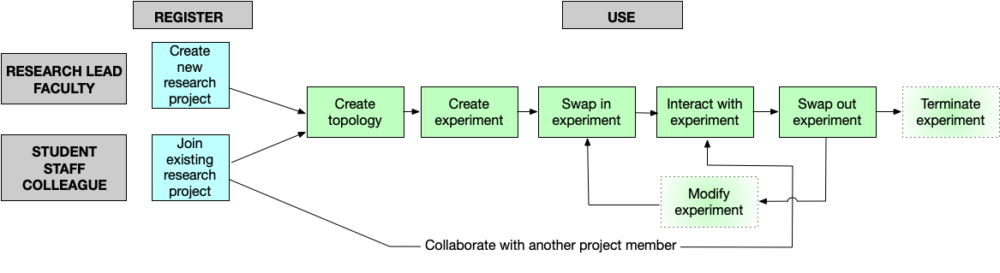
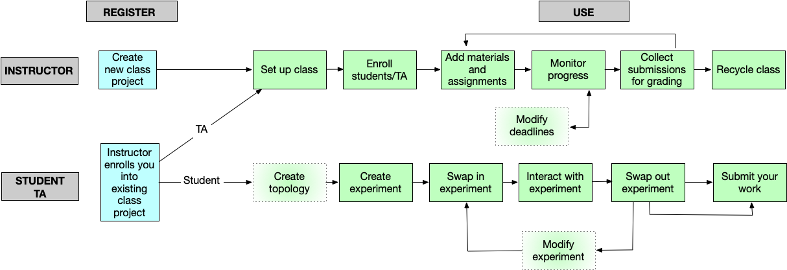

# Quickstart

This page describes basic information about DETERLab and its core functionality. Please make sure to read detailed information about each step by clicking on the links in the menu or on the shapes in the figure.

## What is DETERLab?

The DETERLab testbed is a security and education-enhanced version of Emulab. Funded by the National Science Foundation and the Department of Homeland Security, DETERLab is hosted by USC/ISI and UC Berkeley.

DETERLab (like Emulab) offers user accounts with assorted permissions associated with different experiment groups. Each group can have its own pre-configured experimental environments running on Linux, BSD, Windows, or other operating systems. Users running DETERLab experiments have full control of real hardware and networks running preconfigured software packages.

## How does it work?

The software running DETERLab loads operating system images (low level disk copies) onto free nodes in the testbed, and then reconfigures programmable switches to create VLANs with the newly-imaged nodes connected according to the topology specified by the experiment creator.

After the system is fully imaged and configured, DETERLab executes specified scripts, unpacks tarballs, and/or installs RPM files according to the experiment's configuration. The end result is a live network of real machines, accessible via the Internet.

Work in DETERLab is based on projects that include individual experiments and is accomplished either via the browser-based web interface (isi.deterlab.net) or via commandline on the DETERLab nodes.

To access DETERLab, you need to create an account, which provides credentials for accessing both the web interface and nodes.

## How do I get a DETERLab account?

You may obtain a DETERLab account by either starting a new project (if you are a PI or instructor) or joining an existing project (if you are a project member or a student).

**If you are the project investigator or instructor,** you must create a project and invite your team members or students to join.

**If you are the member of a team using DETERLab,** your project leader will invite you to join the appropriate DETERLab project.

**If you are a student,** you may not create a project. Your instructor must create the project and, once approved, will give you information for joining the project.

See Getting Started for more information.

## How do I use DETERLab?

In general, once you have a DETERLab account, you follow these steps. The DETERLab Core Guide will walk you through a basic tutorial of these steps.

### 1. Design the topology

Every experiment in DETERLab is based on a network topology file written in NS format and saved on the users node. The following is a very basic example:

    # This is a simple ns script. Comments start with #.
    set ns [new Simulator]                 
    source tb_compat.tcl

    # Create 4 nodes
    set nodeA [$ns node]
    set nodeB [$ns node]
    set nodeC [$ns node]
    set nodeD [$ns node]

    # Link between nodeA and nodeB with no delay and 10Mb bandwidth
    set link0 [$ns duplex-link $nodeB $nodeA 10Mb 0ms DropTail]

    # LAN among nodeB, nodeC and nodeD with no delay and 100Mb bandwidth    
    set lan0 [$ns make-lan "$nodeD $nodeC $nodeB " 100Mb 0ms]
    
    # Set the OS on a couple of nodes
    # Ubuntu-STD is the preferred image
    tb-set-node-os $nodeA FBSD-STD
    tb-set-node-os $nodeC Ubuntu-STD         

    # Set up routing
    $ns rtproto Static
    
    # Go!
    $ns run                                 

### 2. Create, start and swap in (allocate resources for) an experiment

Using your topology file, you start a new experiment via menu options in the DETERLab web interface.

### 3. Generate traffic for your nodes

Now you can experiment and start generating traffic for your nodes. We provide a flexible framework to pull together the software you'll need.

### 4. View results by accessing nodes, modify the experiment as needed.

Once your experiment has started, you now can access nodes via SSH and conduct your desired experiments in your new environment.

You may modify aspects of a running experiment through the "Modify experiment" page in the web interface or by making changes to the NS file.

### 5. Save your work and swap out your experiment (release the resources)

When you are ready to stop working on an experiment but know you will want to work on it again, save your files in specific protected directories and swap-out (via web interface or commandline) to release resources back to the testbed. This helps ensure there are enough resources for all DETERLab users.

This is just a high-level overview. Go to the Core Guide for a basic hands-on example of using DETERLab Core. 
