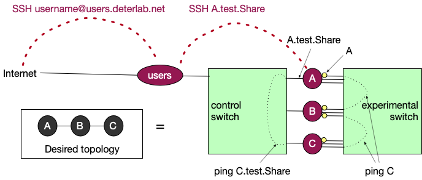

# Interact With Your Experiment

When interacting with your experiment you may want to *access your nodes*, *transfer files*, *generate traffic*, *collect statistics*, or *modify your experiment*. Sections below provide more information about each of these needs.

## Modes of use

There are several ways in which you can use your nodes:

1. **Manual**: As you start developing your experiment, you may want to SSH to your experiment and configure nodes or generate traffic manually. The rest of this document talks about manual use of your nodes.

2. **Automated**: As your work progresses you may want to develop scripts (e.g., using Bash or Python or MAGI or Ansible) to automate running of your experiments. Please see our documentation on [automating your experiments](automate.md).

## Experiment Realization

Imagine an experiment with three nodes A, B, and C where A is connected to B and B to C. Figure below shows the *actual* connections within the testbed.



Each node is connected to two switches - a control switch, which is used to reach into the node from the Internet, and an experimental switch, which is used to create the physical connections between nodes in the same experiment. To connect A to B and B to C, some network interfaces (NICs) connecting to the experimental switch will be configured (see yellow dots denoting these NICs).

When a node becomes part of an experiment (in a given project), it gets
at least two *names*: a *short* name like `A`, and a *long* name like `A.test.Share`. The long name is formed by putting together node name, experiment name and project name, separated by dots.

In the figure above you can see that the short name is the name that relates to the node's connections to the experimental switch, and the long name relates to connections to the control switch.

Imagine that you have opened a terminal window connected to node A. If you type
```
	ping C.test.Share
```
this traffic will reach the node following the black dotted line on the left, going through the control switch. If you type
```
	ping C
```
this traffic will reach	the node following the black dotted line on the	right, going through the experimental switch. More importantly, this traffic will go from A to B and then to C, just like you specified in your topology -- the only way to reach C from A is to go over B.

## Access your nodes

You can access your expreriment through use of SSH and terminal. Please see our [advanced guide to SSH](../DETERSSH/) for some advanced topics. This section provides a basic reference.

First SSH into `users.deterlab.net` using your DETERLab username and password. See the figure above (red dashed lines). Since DETERLab nodes are not directly connected to the Internet you need to SSH into them by first going through `users` and then from `users` into your experiment.

Once you log in to `users`, you'll need to SSH again to your actual experimental nodes using *long* node names, which look like this: `nodeName.experimentName.projectName`. You will not need to re-authenticate.

For example, imagine that you have swapped in `test` experiment under project `Share` and that your username is `YourUsername`. Imagine that you want to access node `A`. You would type the following in your terminal window on your device:
```
	ssh YourUsername@users.deterlab.net
	ssh A.test.Share
```
If you have just started your experiment you may need to wait a few minutes before you can successfully SSH into experimental nodes, because nodes may not be fully set up.

If you happen to terminate the SSH process on your node, or if you set up a firewall rule that blocks SSH traffic, another way to access your node is via [serial console](serial-console.md).

### Shared Filesystem

On DETERLab there are two folders that are mounted over the NFS (network file system) on each node. This includes `users.deterlab.net` and any experimental node that a user allocates. One folder is `/users/YourUsername` or your home folder. *This is why you can create a file on one experimental node in your home folder and it becomes visible in another experimental node in that same folder*. The second folder is `/users/YourProject` where "YourProject" is the project that you are a member of, and that you created your experiment in. That second folder is accessible not only by the user but by all users that are members of that same project (e.g., all students in a class).

### Transfer Files

You can transfer files between your device and your DETERLab experiment by using the *scp* command from the command line. The command has colon (:) and dot (.) characters in certain places. Make sure to type them as is shown in the examples. Our [guide to SSH](../DETERSSH) provides more details.

!!! note
    Home folders on DETERLab are mounted remotely. This means that you can place a file in the home folder on one experimental node or on users.deterlab.net and it will be there when you log into a different node.

Assume that you want to transfer file "myfile.txt" between your device and one of your experimental nodes (e.g., *A.test.Share*).

#### From your device to DETERLab home directory

*On your device* open a terminal window, navigate to the folder with the file "myfile.txt" and type the commands below:
```
	scp myfile.txt YourUsername@users.deterlab.net:.
```
This will place the file into your home folder on DETERLab. This folder is your home folder on any experimental machine as well (see [Behind the scenes](../behind/)), and myfile.txt will be on node *A.test.Share* as well.

#### From DETERLab home directory to your device

Assume that you want to transfer file "myfile.txt" from your home folder on DETERLab to your device.

*On your device* open a terminal window, navigate to the folder where you want to store the file and type the commands below:
```
	scp YourUsername@users.deterlab.net:myfile.txt .
```
#### From your device to DETERLab local folder on experimental node

Assume that you want to transfer file "myfile.txt" from your device to folder "/tmp" on node A.test.Share. You first have to move the file to your DETERLab home folder and then move it to the local node folder.

*On your device* open a terminal window, navigate to the folder where you want to store the file and type the commands below:
```
        scp YourUsername@users.deterlab.net:myfile.txt .
```
SSH to *users.deterlab.net* and then to *A.test.Share* and then type:
```
	cp ~/myfile.txt /tmp/myfile.txt
```

#### From DETERLab local folder on experimental node to your device

Assume that you want to transfer file "myfile.txt" from folder "/tmp" on node A.test.Share to your device. Since this file is *not* in your home directory you have to move it there first. 

SSH to *users.deterlab.net* and then to *A.test.Share* and then type:
```
	cp /tmp/myfile.txt ~/myfile.txt
```
Then *on your device*  open a terminal window, navigate to the folder where you want to store the file and type the commands below:
```
        scp YourUsername@users.deterlab.net:myfile.txt .
```

## Install Software

To contain malicious traffic within experiments, DETERLab has no connectivity to the outside world. To install packages please use our mirrors of popular content:

- Install Ubuntu packages by typing
```
	sudo apt install [package name]
```
- Install Python packages by typing
```
	pip install -i https://fbsd-build.isi.deterlab.net/pypi/web/simple [package name]
```
- Install software from source by: (1) downloading the software into your home directory by typing on `users.deterlab.net` the following `wget [software URL]`, then (2) in your experiment access the software you downloaded in your home directory, extract it and follow install instructions

If you have any other installation needs that are not met with the above instructions please file a ticket.

## Generate Traffic

You can generate traffic in your experiment in many ways. At first, as you are designing your experiment, you may want generate traffic [manually and interactively](../traffic/manual.md). Later, you may want to [write scripts](automate.md) for traffic generation. You may also want to [emulate human actions](../dash/index.md) in your experiments.


## Collect Statistics

For any statistics you collect, please store them locally on the experimental nodes, and not in your home directory. This will minimize traffic on the shared testbed infrastructure.

If you are testing some custom system you wrote, you can log events locally, e.g., in the /tmp directory of the experimental nodes. You may also want to collect traffic traces, e.g., by using *tcpdump*. Please store them locally on the nodes as well. If you need more space to store your data please see [our extended storage options](../storage/).

## Modify Experiment

You can modify your experiment's topology by clicking on the experiment's name in "My Deterlab" view and then clicking on "Modify Experiment" on the left menu. This is best done when the experiment is not currently swapped in. You can also modify the experiment's *settings* such as idle swap and maximum duration if you click on the "Modify Settings" on the left menu.

