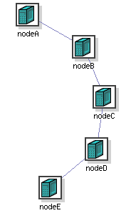

# Setting up IP routing between nodes

As DETERLab strives to make all aspects of the network controllable by the user, we do not attempt to impose any IP routing architecture or protocol by default. However, many users are more interested in end-to-end aspects and don't want to be bothered with setting up routes. For those users we provide an option to automatically set up routes on nodes.

You can use the NS `rtproto` syntax in your NS file to enable routing:

```
    $ns rtproto protocolOption
```

where the `protocolOption` is limited to one of *Session*, *Static* or *Manual*.

* **Session** routing provides fully automated routing support, and is implemented by enabling `gated` running of the OSPF protocol on all nodes in the experiment. This is not supported on Windows XP nodes.
* **Static** routing also provides automatic routing support, but rather than computing the routes dynamically, the routes are precomputed by a distributed route computation algorithm running in parallel on the experiment nodes.
* **Manual** routing allows you to explicitly specify per-node routing information in the NS file. To do this, use the `Manual` routing option to `rtproto`, followed by a list of routes using the `add-route` command:

```
    $node add-route $dst $nexthop
```

where the `dst` can be either a node, a link, or a LAN. For example:

```
    $client add-route $server $router
    $client add-route [$ns link $server $router] $router
    $client add-route $serverlan $router
```

Note that you would need a separate `add-route` command to establish a route for the reverse direction; thus allowing you to specify differing forward and reverse routes if so desired. These statements are converted into appropriate `route(8)` commands on your experimental nodes when they boot.

In the above examples, the first form says to set up a manual route between `$client` and `$server`, using `$router` as the nexthop; `$client` and `$router` should be directly connected, and the interface on `$server` should be unambiguous; either directly connected to the router, or an edge node that has just a single interface.



If the destination has multiple interfaces configured, and it is not connected directly to the nexthop, the interface that you are intending to route to is ambiguous. In the topology shown to the right, `$nodeD` has two interfaces configured. If you attempted to set up a route like this:
```
    $nodeA add-route $nodeD $nodeB
```

you would receive an error since DETERLab staff would not easily be able to determine which of the two links on `$nodeD` you are referring to. Fortunately, there is an easy solution. Instead of a node, specify the link directly:

```
    $nodeA add-route [$ns link $nodeD $nodeC] $nodeB
```

This tells us exactly which link you mean, enabling us to convert that information into a proper `route` command on `$nodeA`.

The last form of the `add-route` command is used when adding a route to an entire LAN. It would be tedious and error prone to specify a route to each node in a LAN by hand. Instead, just route to the entire network:

```
    set clientlan [$ns make-lan "$nodeE $nodeF $nodeG" 100Mb 0ms]
    $nodeA add-route $clientlan $nodeB
```

In general, it is still best practice to use either *Session* or *Static* routing for all but small, simple topologies. Explicitly setting up all the routes in even a moderately-sized experiment is extremely error prone. Consider this: a recently created experiment with 17 nodes and 10 subnets **required 140 hand-created routes in the NS file**.

Two final, cautionary notes on routing:

* The default route *must* be set to use the control network interface. You might be tempted to set the default route on your nodes to reduce the number of explicit routes used. **Please avoid this.** That would prevent nodes from contacting the outside world, i.e., you. 
* If you use your own routing daemon, you must avoid using the control network interface in the configuration. Since every node in the testbed is directly connected to the control network LAN, a naive routing daemon configuration will discover that any node is just one hop away, via the control network, from any other node and *all* inter-node traffic will be routed via that interface.

