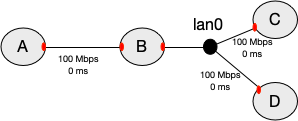

!!! important
    This page is deprecated. Please use our <a href="https://launch.mod.deterlab.net/">new platform</a> and accompanying documentation.

# Create Experiment Topology

Part of DETERLab's power lies in its ability to assume many different topologies; the description of a such a topology is a necessary part
of an experiment.  Before you can start your experiment, you must model the elements of the experiment's network with a topology. Create your topology in a text file using any text editor you like (e.g., Notepad on Windows, vi, vim, emacs, nano or pico on Linux or TextEdit on Mac)

**For this basic tutorial, use this <a href="../../downloads/basic.ns">NS file</a> which includes a simple topology and save it locally on your device **

The rest of this section describes NS format and walks you through the different parts of the sample file.

## NS Format 

DETERLab uses the "NS" ("Network Simulator") format to describe network topologies. You can see the list of <a href="../../ns-commands/">supported commands</a>.

### Basic Example 

In our example, we are creating a test network which looks like the following:



*Figure 1: A is connected to B with a link, and B to C and D with a LAN.*

The red shapes on the nodes denote network interfaces. Each physical node has a limited number of interfaces (usually 3-4).

Here's how to describe this topology:

**Step 1. Prologue**

All NS files start with a simple prologue, declaring a simulator and including a file that allows you to use the special `tb-` commands:

```
	# This is a simple ns script. Comments start with #.
	set ns [new Simulator]
	source tb_compat.tcl
```

**Step 2. Define the nodes in the topology**
```
  	set A [$ns node]
  	set B [$ns node]
  	set C [$ns node]
  	set D [$ns node]
```

`A`, `B`, `C`, `D`  are names of the nodes in your topology. You can use any alphanumeric string, as long as it starts with a letter. 

**Step 3. Define the link and the LAN that connect the nodes**

NS syntax permits you to specify the bandwidth, latency, and queue type. When you specify bandwidth that is not divisible by 10Mbps or latency that is different from 0, the testbed inserts another node on the link to emulate these conditions. Unless you absolutely need different settings, please specify 10 Mbps, 100 Mbps, 100 Mbps or 1000 Mbps bandwidth and 0 ms delay.
```
  	set link0 [$ns duplex-link $A $B 100Mb 0ms DropTail]
  	set lan0 [$ns make-lan "$B $C $D" 100Mb 0ms]
```
The difference between a link and a LAN is how many nodes they can connect. A link can only connect two nodes. A LAN can connect any number of nodes (in our example 3 nodes). 

In addition to the standard NS syntax above, a number of <a href="../../ns-commands/">extensions</a> are available in DETERLab that allow you to better control your experiment.
For example, you may specify what Operating System is booted on your nodes, the IP addresses to be assigned to network interfaces (red shapes in the picture), the hardware for each node, etc. 

**Step 4. Enable routing**

In a topology like this, you will likely want to communicate between all the nodes, including nodes that aren't directly connected, like `A` and `C`. In order for that to happen, we must enable routing in our experiment, so `B` can route packets for the other nodes. 

The typical way to do this is with Static routing.
```
  	$ns rtproto Static
```

**Step 5. Epilogue**

All NS files have the following epilogue.

```
 	# Go!
  	$ns run
```


## Advanced options

DETERLab has many advanced options, which you can use to customize your topology.

1. You can specify a different [hardware](../ns-commands/#hardware-commands) for each node

2. You can specify which [OS image](../ns-commands/#os-commands) the node should load. You can customize one of existing OS images to add your own configuration, files and applications, then create a [custom OS image](../custom-images) and use that image on your nodes.

3. You can specify link loss, delay or limited bandwidth on your links

4. You can assign any [IP address](../ns-commands/#ip-address-commands) to your nodes (as long as it is not from 198.162.*.* address range)

5. You can specify [routing](routing.md) between nodes

6. You can install [RPMs](../ns-commands/#tb-set-node-rpms) or [tarballs](../ns-commands/#tb-set-node-tarfiles) during experiment swap in and [specify commands](../ns-commands/#tb-set-node-startcmd) to run automatically on each swap in.

7. You can implement [end-node traffic shaping](link-delays.md).

Please see full [NS command reference](ns-commands.md).