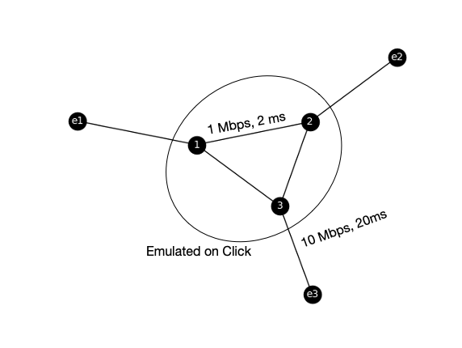

!!! important
    This page is deprecated. Please use our <a href="https://launch.mod.deterlab.net/">new platform</a> and accompanying documentation.

# Core Principles of Network Emulation on Deterlab

To use network emulation, you need to represent your topology as a list of edges. Some edges may have attributes, such as bandwidth and delay associated with them. To specify nodes that will not be modeled on a Click router (enclave
nodes, usually at the edges of topology) preface their names with the letter "e", like "e1". Nodes that will be modeled on a Click router are denoted by numbers (e.g., 1 2 represents an edge between node 1 and node 2). Attributes for an edge are specified in a json format (attribute: value) following the edge.

For example, the following edge-list file represents a topology of two enclaves (one node each) and two core nodes with some edges between them (no attributes):

    # This is a simple edge list
    e1 1
    e2 2
    1 2

The resulting topology is illustrated in the figure below:

Here is another edge list example, which represents a topology with three enclaves and three core nodes. Some edges have defined attributes (in json format) like bandwidth and delay.

     # A more complex edge list
     e1 1
     e2 2
     e3 3 {"bw": "10Mbps", "delay": "20ms"}
     1 2
     1 3
     2 3 {"bw": "1Mbps", "delay": "2ms"}

The resulting topology is illustrated in the figure below:

Now please proceed to the [tutorial](../tutorial) to see how to generate NS files and Click templates from these basic topology models, and validate them on Deterlab.