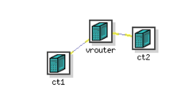
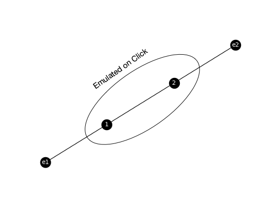

!!! important
    This page is deprecated. Please use our <a href="https://launch.mod.deterlab.net/">new platform</a> and accompanying documentation.

# Network Emulation Tutorial

In this tutorial we will show you how to create an experiment with emulated network.

## Step 1: Clone the Repository

First, you need to clone the repository that contains scripts that convert
edge-list representation of the topology into scripts and NS file that can
run on Deterlab. You can do this on your device or on users.deterlab.net.

```
   git clone https://github.com/ISIEdgeLab/graphGen.git
   cd graphGen
```

## Step 2: Create Edge-list Representation of Your Topology

We will use the basic example with two enclaves and two nodes that was described previously. You can find this example in the cloned repository, in the file `/tests/inputs/basic.xnet`:

```
   e1 1
   e2 2
   1 2
```

## Step 3: Convert Edge-list to NS Representation

The program graph_gen.py has many optional arguments to use (check developer documentation if you want to learn more). From the base folder where you cloned the git repository type the following:

```
    cd graphGen
    python graphgen/graph_gen.py tests/inputs/basic.xnet -n tutorial.ns --click-hardware MicroCloud --disable-crypto-nodes --num-servers 0 --num-clients 0 --CT-OS Ubuntu-STD --ct-hardware pc3000
```

!!! note
    Sometimes the above command cannot be pasted properly due to double dashes in options. Ensure that the command you are executing has the correct options and arguments.
    
Be aware that nodes you can specify in the --click-hardware directive at the time are MicroCloud, dl380g3 and sm. You can specify any node type for --ct-hardware option.

After running graphGen framework, you'll have two new files: `vrouter.template` and `tutorial.ns`. 

## Step 4: Deploy Your Experiment on Deterlab

Copy your `vrouter.template` and `tutorial.ns` files to DETERLab, if they are not there already. Then run:

```
     bash /share/click/exp_scripts/saveresources.sh tutorial.ns
```     

to minimize the number of physical nodes you will need for deployment.

On users.deterlab.net create a folder with the same name as the NS file ('tutorial' in this example) you want to create, inside the directory `/proj/YourProject/templates`. Copy `vrouter.template` file there.

```
   mkdir /proj/YourProject/templates/tutorial
   cp vrouter.template /proj/YourProject/templates/tutorial
```

Next, use the tutorial.ns file to create a new DETERLab experiment and swap it in.

To see how the network looks like, you can click 'Visualization; tab and the network's diagram should look like this:



Be aware that the DETER topology hides the emulated nodes within vrouter. The vrouter node emulates your specified core topology, which actually looks like this.



## Step 5: Verify Setup

Swap in your experiment (we will assume that the experiment name is *YourExperiment*) and check if the components are running correctly.

### Check Click Is Running

Check if click is actually running on vrouter node.

```
      ssh vrouter.YourExperiment.YourProject
      ps axuw | grep click
```

If Click isn't running, the problem may be in the *coremask* argument for DPDK when Click is being started. We use DPDK to emulate your desired topology on Click.
The coremask parameter is always mandatory for DPDK applications. Each bit of the mask corresponds to the number of cores on the machine. You can check how many cores your vrouter node has by doing the following on the node:

```
    lscpu
```

and look at the *CPU(s)* line in the output. Then use the mask with that many bits set to 1 (-c parameter). For example, if the vrouter node has 8 cores we would start the Click router by typing

```
	click --dpdk -c 0xff -n 4 -- -u /click /tmp/vrouter.click >/tmp/click.log 2>&1 < /dev/null &
```

### Check Liveness and Loss 

You can use ping command to check liveness and packet loss. To install ping, type the following on *ct1* node:

```
    sudo apt-get install -y ping
```


Then check that you can ping node ct2 from ct1:

```
    ssh ct1.YourExperiment.YourProject
    ping ct2
```

You should see an output similar to below:

```
    PING ct2-elink2 (10.2.2.1) 56(84) bytes of data.
    64 bytes from ct2-elink2 (10.2.2.1): icmp_seq=1 ttl=62 time=4.68 ms
    64 bytes from ct2-elink2 (10.2.2.1): icmp_seq=2 ttl=62 time=2.22 ms
    64 bytes from ct2-elink2 (10.2.2.1): icmp_seq=3 ttl=62 time=2.12 ms
    64 bytes from ct2-elink2 (10.2.2.1): icmp_seq=4 ttl=62 time=2.11 ms
    --- ct2-elink2 ping statistics ---
    4 packets transmitted, 4 received, 0% packet loss, time 3004ms
    rtt min/avg/max/mdev = 2.119/2.786/4.681/1.095 ms
```

This indicates 0% loss and 2ms delay, which is what we expect based on the desired core topology.

### Checking Bandwidth

You can use iperf command to check bandwidth between your nodes. To install iperf, type the following on *ct1* and *ct2* nodes:

```
    sudo apt-get install -y iperf
```

Then run on ct1 node:

```
     iperf -s commnad
```

and on ct2 node:
```
     iperf -c ct1
```

Let the measurement run for a few seconds. You should see the output similar to the one below:

```
------------------------------------------------------------
Client connecting to ct1, TCP port 5001
TCP window size: 85.0 KByte (default)
------------------------------------------------------------
[  3] local 10.2.2.1 port 47962 connected with 10.1.2.1 port 5001
[ ID] Interval       Transfer     Bandwidth
[  3]  0.0-10.0 sec  1.03 GBytes   887 Mbits/sec
```

This output indicates that the bandwidth is around 1Gbps (887Mbps).


Finally, you should check if the routing level is working correctly with a command like traceroute. To check that you have reachability from one enclave to the other, you can install traceroute on ct1 and run it

```
	sudo apt install -y traceroute
	traceroute ct2
```

You should see three hops (two intermediate nodes) between ct1 and ct2 in traceroute's output.

##  Different available models

If you want to explore different models, you can take a look at `/share/click/templates`, where you'll find many models with different number of enclaves, node types, number of nodes and other options. Moreover, many of these models have their ns file, enclave.routes file, vrouter.template, among others. Each folder has an image file, illustrating the topology.

