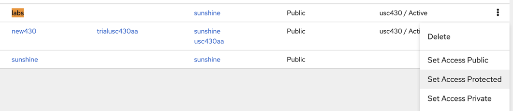

# Migrating Your Materials

These instructions assume that you had a mix of shared materials and your own private materials in your class.

## Migrating Shared Materials

If you have used shared materials in your class, they have all been updated. You simply need to delete them from your class and re-adopt them.

## Migrating Private Materials

To migrate private materials, you should apply the following steps.

### Create Topology File

These instructions can be followed for each private exercise

   1. If you have a custom NS file in your instructions, **on old DeterLab** you can translate it into new topology format. On **users.deterlab.net** run `perl /usr/local/bin/ns2model.pl <projname> <expname> <path-to-ns-file>`. The new topology file will be printed out.
   
2. You can copy the topology onto your clipboard and include it in your instructions to students. Then ask your students to follow [this guide](https://mergetb.org/docs/experimentation/hello-world-gui/) to start an experiment with that topology (or in Merge speak "model"). You can also take additional steps to enable students to run experiments with the given topology from their XDC by using `startexp`. The following steps cover this second use case.

### Create Protected Project

These instructions should be followed only once per class (not per class offering)

3. Log into [our new platform](https://launch.mod.deterlab.net) and click on Projects. Create a new project in your organization (usually your organization will be your class name). You only have to do this once.

Make the project protected:

4. Click on XDC on the left menu, then create an XDC in your new project. Please wait around 5 minutes for XDC to be fully initialized.

5. Click on XDC on the left menu, then click on Jupyter and then on Terminal app. Only the first time you access this XDC, type the text below in the Terminal, replacing `yourusername` and `yourpassword` with your actual information.
```
su - yourusername
echo "PATH=$PATH:/share" > .profile
echo yourpassword > pass.txt
exit
su - yourusername
```
Every other time you access the XDC look at the command line prompt. If the prompt looks like `#`, type
```
su - yourusername
```

### Add Students to Project

These instructions should be followed once per class offering

7. Type the command below, replacing `projname` and `org` with your actual information. You need to do this only once per semester.
  ```
  addstudents projname org
  ```

This will add all your current students to your new project.

If new students enroll into your class you can repeat this action without any ill consequences.


### Populating Private Lab

8. Create a folder structure that looks like illustrated in the figure below. Red text denotes names of files or folders that should not be changed. Files are denoted by F and folders by D label. Our example assumes you had three-node topology with node names X, Y and Z. Nodes X and Y needed some set up for your lab and node Z did not. All node names are listed in `nodes` file. Only those nodes that need setup have a separate folder with `install` script inside. That script should have `a+rx` permissions. You can see sample `install` scripts in the illustration. If there are any files or folders that should be copied onto individual nodes at setup time, please place them into the corresponding nodes' folders and they will be copied when students run `runlab`. In the illustration, file `file1` will be copied onto `/tmp/X` folder on node `X` and folder `folder1` will be copied into `/tmp/Y/folder1` on node `Y`.


If you previously used start-cmd to set up your nodes, then in each install file you would copy-paste the contents of the start-cmd script you originally had. You will also need to modify these contents in the following way.

  * For each command that uses a file from a user's home directory, a project directory or /share directory, you will need to copy that file into the given subfolder in /organization, and modify the command to look for it in the node's local `/tmp` folder under the folder with the node's name.

  * For example if node `a` previously ran a start-cmd directive that was doing `somecmd /share/somefile` you would copy `somefile` from old DeterLab into `/organizations/labname/a/somefile` on your XDC. See [our scp instructions](https://mergetb.org/docs/experimentation/xdc/#copying-files-to-or-from-your-xdc) for how to copy files. You can also see some step-by-step examples [in this lab exercise](https://www.isi.deterlab.net/file.php?file=/share/education/twonode/html).

  * Once you copy the file, you would also change the command from `somecmd /share/somefile` to `somecmd /tmp/a/somefile`. In the illustration this is done to copy contents of `folder1` into `/var/www/html` on node `Y`.

## How Can Students Run Exercises

1. Your students can run shared exercises by typing `startexp labname` as described in [guidelines for students](https://mergetb.org/docs/experimentation/classes/#working-on-assignments)

1. Your students can run your private exercises by typing `startexp labname -o projname` or they can follow [this guide](https://mergetb.org/docs/experimentation/hello-world-gui/) to start an experiment with the topology you give them in student materials.