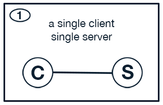

!!! important
    This page is deprecated. Please use our <a href="https://launch.mod.deterlab.net/">new platform</a> and accompanying documentation.

# Orchestrator Case Studies

This section includes more detailed descriptions of how to conduct an experiment in DETERLab using MAGI Orchestrator. Each case study also includes a complete archive with logs and data files. Before you try out the examples below, we recommend reading the <a href="../orchestrator-guide/">MAGI Orchestrator Guide</a>.

## Simple Client Server

## Scaled Client Server

## Feedback

