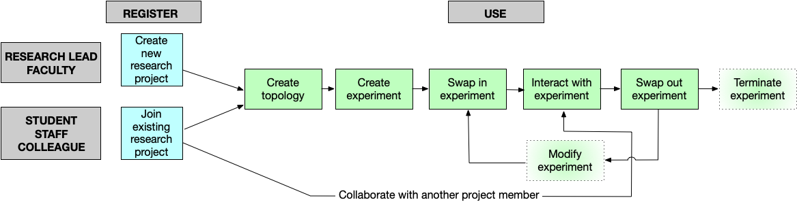

!!! important
    This page is deprecated. Please use our <a href="https://launch.mod.deterlab.net/">new platform</a> and accompanying documentation.

# Quickstart

This page describes basic information about DETERLab and its core functionality. Please make sure to read detailed information about each step by clicking on the links in the menu or on the shapes in the figure.

## What is DETERLab?

The DETERLab testbed is a testbed for cybersecurity experimentation. It is an open public testbed and it is free for research and educational use, as well as for commercial product development and testing.

DETERLab users gain superuser access to physical or virtual machines, and can install and run applications of their choice. Connections between machines (topology and routes) can also be configured by the user to meet their research needs.

DETERLab is similar to a cloud, in a sense that one can allocate multiple nodes for an experiment. However, in a cloud users often receive *virtual machines*, and set them up with *similar configurations* to perform *computation tasks*. In DETERLab, users request *physical machines*, and also specify *their connections*. Users often set up these machines with *different configurations*, and use them to perform *system and network tasks*, and to *generate traffic*.

## Using DETERLab

### Research Users

If you want to use DETERLab in your research your interaction will resemble the illustration below (pale colored shapes denote optional steps). Please explore links just below the diagram to learn more about how to register for, and interact with DETERLab as a researcher.

#### For research users

- [Create new research project](support/research.md)
- [Join existing research project](../support/research/#requesting-an-account-to-join-an-existing-project)
- [Create topology](core/topology.md)
- [Create experiment](core/create.md)
- [Swap in experiment](core/swapin.md)
- [Interact with experiment](core/interact.md)
- [Swap out experiment](core/swapout.md)
- [Modify experiment](../core/interact/#modify-experiment)
- [Terminate experiment](core/swapout.md)

### Class Users

If you want to use DETERLab to teach a class or if you are a student in the class that requires DETERLab use, your interaction will resemble the illustration below (pale colored shapes denote optional steps). Please explore links just below the diagram to learn more about how to register for, and interact with DETERLab as a class user.

#### For instructors and TAs

- [Create new class project](support/class.md)
- [Set up class](education/course-setup.md)
- [Enroll students/TAs](../support/class/#creating-accounts-for-your-ta-and-students)
- [Add materials and assignments](../education/course-setup/#materials)
- [Monitor progress](../education/course-setup/#monitoring-progress)
- [Collect submissions for grading](../education/course-setup/#downloading-submissions)
- [Modify deadlines](../education/course-setup/#managing-assignments)
- [Recycle class](../education/course-setup/#course-wrap-up)

#### For students

- [Create topology](core/topology.md)
- [Create experiment](core/create.md)
- [Swap in experiment](core/swapin.md)
- [Interact with experiment](core/interact.md)
- [Swap out experiment](core/swapout.md)
- [Modify experiment](../core/interact/#modify-experiment)
- [Terminate experiment](core/swapout.md)
- [Submit your work](education/submit-work.md)

