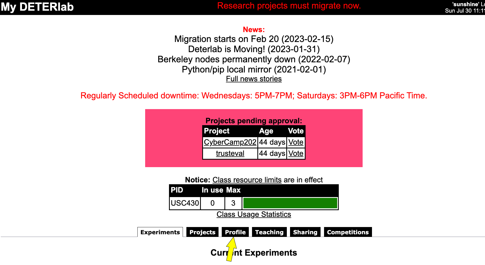
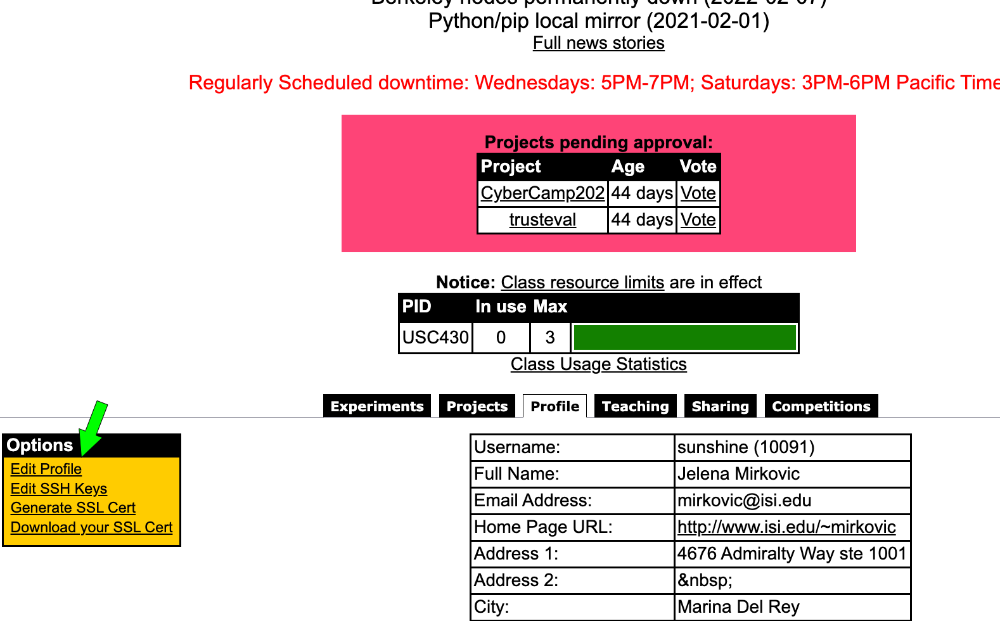
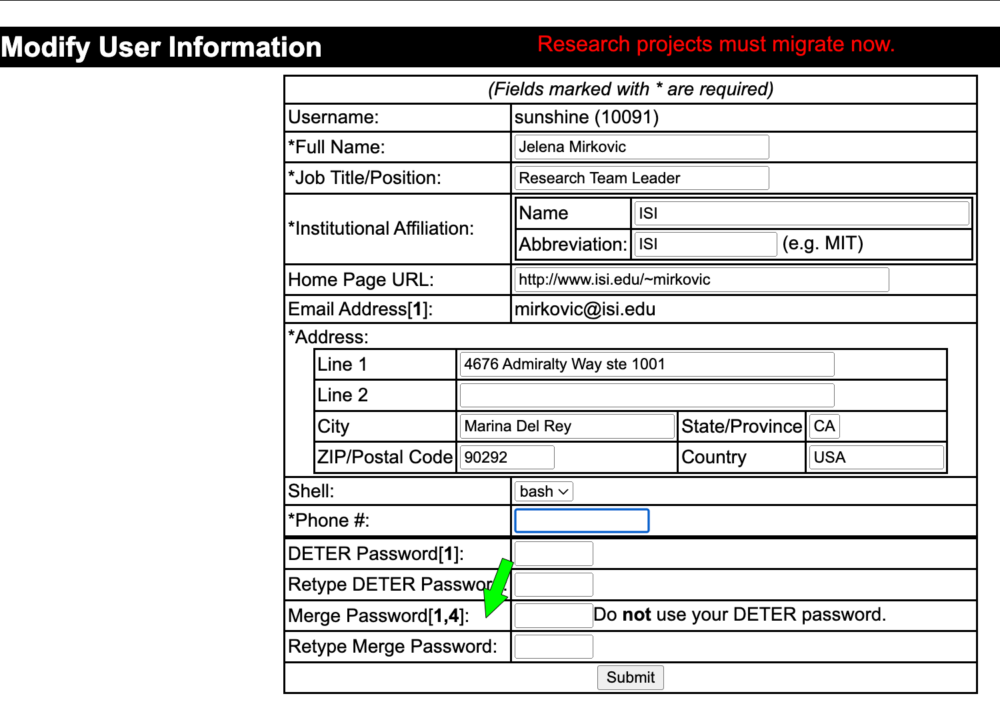

!!! note
    This page is updated to show the workflow with our <a href="https://launch.mod.deterlab.net/">new platform</a>.

# Migration Instructions

At this time **all** projects must migrate to our <a href="https://launch.mod.deterlab.net/">new platform</a>. Class projects can continue to use this user interface for class management purposes. All experimentation will occur on our new platform and old machines will be decomissioned. Instructions below show how to migrate existing projects to our new platform.

## Migrating Class Projects

1. Edit your User Profile to set up Merge password (it is currently set at random, please reset it to a string of your choosing if you wish). See illustrations below.

Access your profile:



Edit profile:



Set up Merge password:


2. Click on _Teaching_ tab, then choose your class and click on _Migrate Class_ from the left menu.

To migrate your existing class materials please see [our guidelines here](../../education/migrating-materials).

## Migrating Research Projects

1. Carefully read [Merge documentation](https://mergetb.org/docs/)
2. Apply for account on the new DeterLab [here](https://launch.mod.deterlab.net/registration). Please select a password that is strong but easy for you to remember and type. For example, passwords that contain 5+ words significant to you should work.
3. Wait for approval, which should arrive via email
4. Log into  `users.deterlab.net` and edit `.ssh/config` file by following instructions [here](https://mergetb.org/docs/experimentation/xdc/#ssh-configuration-for-old-openssh-versions).
5. Set up an XDC (experiment development container), which will serve as your gateway into the new DeterLab, by following the instructions [here](https://mergetb.org/docs/experimentation/hello-world-gui/#create-an-xdc).  If everything is set up correctly, you should be able to SSH into your first XDC by typing on `users.deterlab.net` the following command `ssh <xdcname>-<yourusername>`. There is no need to create new experiments at this step, although you are welcome to try it.
6. Migrate your projects, experiments and data by following instructions below this list
7. Put in a [DeterLab ticket](getting-help.md) to let us know you have migrated your items.
8. From this point on please do not use old DeterLab anymore.

To migrate a project X using your new username U, type on `users.deterlab.net`:

```
migrate U X (you will be prompted for password)
```

Experiments in your project will be automatically converted and migrated to a new project on our new infrastructure. Project and experiment naming conventions have changed, so you may notice some differences. New project and experiment names must be all lower-case and alphanumeric only. In addition to this, current OS images on the new infrastructure differ from the existing OS images, and there is currently no support for startup commands. Thus, during experiment conversion OS, hardware and startup directives are skipped.

You will also need to migrate any data in your personal user directory, which you want to keep. To do so, create folder `newdeter` in your home directory, and move into it all files and folders that you want to keep. Then run:

```
migrate U (you will be prompted for password)
```

!!! note
    We can only support migration of up to 10 GB per user or per project. Please delete any large files that you will not need going forward. If you need more space, please contact us at [testbed-ops@isi.deterlab.net](mailto: testbed-ops@isi.deterlab.net)


# Migration FAQ

## Who should migrate?

All research projects and users (project leaders and research students) should migrate to our new infrastructure by May 1st, 2023. Class users and projects can remain on the old infrastructure until summer 2023. They should plan to migrate over the summer. If you are project leader on DeterLab and you have both research and class projects, you should migrate your account and your research projects now.

## What are the advantages of the new infrastructure?

There are multiple advantages to users from migrating to the new infrastructure:

* You will be able to request virtual machines, and thus run larger scale experiments.
* You should experience less resource contention. It will be easier to obtain resources.
* Experiments will be set up quickly - within seconds instead of minutes
* Experiment specification errors will be caught early, before resources are committed
* All experiments will have external access for software installation

## What are the differences between the old and the new infrastructure?

* The new infrastructure is running a new software, called Merge, which is more stable, robust and modular than the old software.
* The new infrastructure has all new hardware - end servers and switches - and will be more stable.
* The new infrastructure has a new UI for experiment management (creation, swap in/out, termination)
* The new infrastructure has a new access process: you still SSH twice but the SSH process should be smoother
* The new infrastructure has a new topology definition language

## Where can I learn more?
- Please read [Merge documentation](https://mergetb.org/docs/)


